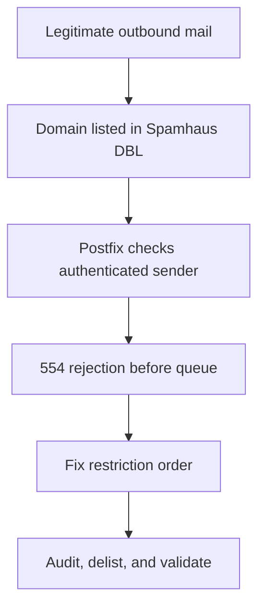

<!-- markdownlint-disable MD013 -->

<div align="center">

# Recovering a Mail Domain from Spamhaus DBL

**A practical Postfix incident runbook: contain, investigate, recover, delist, and prove the result**

[](https://www.postfix.org/)
[](https://www.spamhaus.org/blocklists/domain-blocklist/)
[](https://mailinabox.email/)
[](https://datatracker.ietf.org/doc/html/rfc5737)

[Start here](#start-here) · [Audit workflow](#audit-workflow) ·
[Recovery](#safe-postfix-recovery) · [Tool-assisted workflow](#tool-assisted-workflow)

</div>

---

> [!NOTE]
> Every hostname, email address, IP address, and Message-ID below is a
> documentation placeholder. Never publish production mail data, SASL maps,
> credentials, private headers, or customer identifiers.

## Table of contents

- [Start here](#start-here)
- [Incident summary](#incident-summary)
- [The important distinction: domain vs. IP reputation](#the-important-distinction-domain-vs-ip-reputation)
- [Why the server blocked its own users](#why-the-server-blocked-its-own-users)
- [Immediate containment](#immediate-containment)
- [Audit workflow](#audit-workflow)
- [Evidence outside the mail server](#evidence-outside-the-mail-server)
- [Safe Postfix recovery](#safe-postfix-recovery)
- [When an SMTP relay helps](#when-an-smtp-relay-helps)
- [SPF, DKIM, and DMARC after adding a relay](#spf-dkim-and-dmarc-after-adding-a-relay)
- [Spamhaus removal request](#spamhaus-removal-request)
- [End-to-end validation](#end-to-end-validation)
- [Automated recovery](#automated-recovery)
- [Tool-assisted workflow](#tool-assisted-workflow)
- [What the investigation proved](#what-the-investigation-proved)
- [Operational checklist](#operational-checklist)
- [References](#references)

---

## Start here

| Observation | Meaning | Immediate action |
| --- | --- | --- |
| Own domain returns a real `127.0.1.x` DBL code | Domain-reputation incident | Contain, audit, and submit a removal request |
| Origin IP is listed or SMTP/25 is blocked | Route/IP incident | Consider a reputable authenticated relay |
| Authenticated users receive local `554` + `NOQUEUE` | Postfix self-block before queue | Correct sender-restriction order |
| `127.255.255.x` is returned | DNSBL policy/query error | Fix the query path; do not treat it as a listing |
| Trigger is unknown after a clean audit | Normal evidentiary boundary | Record what was disproved and inspect off-server evidence |

> [!IMPORTANT]
> A relay changes the route and outbound IP, not the sender domain's identity or
> reputation. Publish and verify relay SPF authorization **before** changing
> `relayhost`.

---

## Incident summary

A legitimate corporate mail domain was added to the Spamhaus Domain Blocklist
after only a few days of real outbound activity.

The mail server had been online for months. SPF, DKIM, DMARC, forward DNS,
reverse DNS, TLS, and authenticated submission were already configured. The
server was not an open relay.

During the four days before the listing, Postfix accepted:

| Metric | Observed value |
| --- | ---: |
| Authenticated messages | 9 |
| Envelope recipients | 40 |
| External bounces before listing | 0 |
| External deferrals before listing | 0 |
| Unauthorized SMTP sources found | 0 |

Most messages were normal person-to-person operational correspondence:
clearance requests, statements of account, daily reports, and replies inside
existing business threads.

Then Postfix began returning:

```text
554 5.7.1 Service unavailable; Sender address blocked using dbl.spamhaus.org
```

The Spamhaus lookup returned `127.0.1.2`, which means the sender domain was
listed as a spam domain in DBL.

The external reputation event then became an internal outage: a local Postfix
restriction checked the domain of authenticated users and rejected their
messages before they entered the queue.



> [!NOTE]
> Examples below use `example.com`, `box.example.com`, and documentation IP
> addresses. Replace them with values from your environment.

---

## The important distinction: domain vs. IP reputation

Spamhaus DBL is a **domain-only** blocklist. It is not an IP blocklist.

That distinction changes the recovery plan:

| Listing type | What is listed | Can a new outbound relay help? |
| --- | --- | --- |
| IP blocklist | Originating SMTP IP | Often, because the visible sending IP changes |
| Spamhaus DBL | Sender or content domain | Not by itself; the domain remains visible |

An SMTP relay changes the next hop and usually the public delivery IP. It does
not hide the domain in:

- the SMTP envelope sender;
- the visible `From` header;
- the DKIM signature;
- `Message-ID`;
- links in the message body.

This was confirmed during the incident. An external relay accepted some test
messages but rejected another legitimate multi-recipient message. Its scanner
still assigned a large score to the DBL-listed domain.

> [!IMPORTANT]
> A relay is useful for IP reputation problems and temporary delivery
> continuity. It is not a replacement for fixing domain reputation or
> completing the Spamhaus removal process.

---

## Why the server blocked its own users

The affected Postfix configuration evaluated a sender RHSBL before allowing an
authenticated submission:

```ini
smtpd_sender_restrictions =
    reject_non_fqdn_sender,
    reject_unknown_sender_domain,
    reject_authenticated_sender_login_mismatch,
    reject_rhsbl_sender dbl.spamhaus.org=127.0.1.[2..99]
```

When the local domain appeared in DBL, the same rule intended to filter
untrusted senders also evaluated:

- authenticated users submitting through SMTP;
- webmail connecting through localhost with SASL authentication;
- a local management process sending status mail through loopback.

The rejection happened during the SMTP transaction and was logged as
`NOQUEUE`. The message never entered the Postfix queue, so changing `relayhost`
could not help it.

The safe order for this environment was:

```ini
smtpd_sender_restrictions =
    reject_non_fqdn_sender,
    reject_unknown_sender_domain,
    reject_authenticated_sender_login_mismatch,
    permit_sasl_authenticated,
    permit_mynetworks,
    reject_rhsbl_sender dbl.spamhaus.org=127.0.1.[2..99]
```

The order matters:

1. `reject_authenticated_sender_login_mismatch` remains first, so an
   authenticated user cannot send as another local mailbox.
2. `permit_sasl_authenticated` allows authenticated submission.
3. `permit_mynetworks` allows trusted local processes.
4. `reject_rhsbl_sender` continues filtering untrusted external senders.

> [!WARNING]
> Do not add `permit_mynetworks` blindly. First verify that `mynetworks`
> contains only networks you intentionally trust. In this incident it was
> loopback-only.

---

## Immediate containment

Before editing Postfix:

1. Pause bulk, automated, and multi-recipient sending.
2. Ask users to send only necessary business mail.
3. Preserve the mail logs before rotation removes evidence.
4. Confirm whether the listing affects the IP, domain, or both.
5. Check for unauthorized authenticated users and unexpected source IPs.
6. Review the queue without flushing or deleting it.

Check the current state:

```bash
sudo postconf relayhost
sudo postconf mynetworks
sudo postconf smtpd_sender_restrictions
sudo postconf -M
sudo postqueue -p
```

Find every place that references the Spamhaus DBL:

```bash
sudo grep -Rni 'dbl\.spamhaus\.org' /etc/postfix
```

Check whether `master.cf` overrides the global restriction for a particular
service:

```bash
sudo postconf -Mf
sudo grep -nE 'smtpd_sender_restrictions|^-o ' /etc/postfix/master.cf
```

If a generated mail stack such as mailcow, Docker Mailserver, or Zimbra owns
the Postfix configuration, use that platform's supported templates instead of
editing generated files directly.

---

## Audit workflow

The objective is not to guess which user is "responsible." It is to reconstruct
the SMTP evidence:

- when the first listing-related rejection appeared;
- which accounts authenticated;
- where they connected from;
- how many messages Postfix accepted;
- how many envelope recipients were used;
- what was sent, bounced, or deferred;
- whether recipients were part of established correspondence.

### 1. Build a focused log window

Adjust the dates to cover several days before the first DBL rejection:

```bash
sudo zgrep -hE '^Jul (24|25|26|27|28) ' /var/log/mail.log* \
  | sudo tee /root/dbl-window.log >/dev/null

sudo wc -l /root/dbl-window.log
```

On RHEL-family systems the log is commonly `/var/log/maillog`. On systems
using only journald, export the equivalent time range with `journalctl`.

### 2. Establish the first DBL rejection

```bash
sudo grep 'blocked using dbl.spamhaus.org' /root/dbl-window.log \
  | head -20
```

The first occurrence gives an **upper bound**: the domain was already listed
at that moment. It does not prove the exact listing time or identify the
triggering message.

### 3. Identify authenticated users and connection sources

```bash
sudo grep 'sasl_username=' /root/dbl-window.log \
  | sed -nE 's/.*client=([^,]+).*sasl_username=([^, ]+).*/\2 | \1/p' \
  | sort | uniq -c | sort -nr
```

Look for:

- unfamiliar usernames;
- public source IPs that do not belong to users;
- impossible travel or simultaneous logins;
- a sudden jump in volume;
- clients bypassing the expected submission path.

`localhost[127.0.0.1]` is normal for webmail that submits through the local
Postfix service. It still appears as authenticated SMTP when SASL is used.

### 4. Correlate accepted submissions by Queue ID

First extract unique Queue IDs from authenticated submissions:

```bash
sudo grep 'sasl_username=' /root/dbl-window.log \
  | grep -v 'NOQUEUE' \
  | sed -nE 's/.*: ([[:alnum:]]+): client=.*sasl_username=.*/\1/p' \
  | sort -u \
  | sudo tee /root/dbl-qids.txt >/dev/null
```

Then collect every log line related to those messages:

```bash
sudo grep -Ff /root/dbl-qids.txt /root/dbl-window.log \
  | sort -k2,2n -k3,3 \
  | sudo tee /root/dbl-outbound.log >/dev/null

sudo wc -l /root/dbl-qids.txt /root/dbl-outbound.log
```

This is more reliable than counting `to=<...>` lines alone: one message can
produce many recipient-specific delivery records.

### 5. Review delivery outcomes

```bash
sudo grep -E 'status=(sent|bounced|deferred)' /root/dbl-outbound.log
```

Interpret the result carefully:

| Log result | Meaning |
| --- | --- |
| `NOQUEUE` | Rejected before Postfix accepted the message |
| `status=sent` | The next SMTP hop accepted the message |
| `status=deferred` | Temporary delivery failure; Postfix will retry |
| `status=bounced` | Permanent failure; a delivery-status notification is normally generated |

`status=sent` is not proof that the message reached the recipient's inbox. If
the next hop is a relay, it only proves that the relay accepted responsibility.

Messages rejected with `NOQUEUE` are not waiting in `postqueue -p`; users must
resend them after the restriction is fixed.

### 6. Find delivery-status notifications

```bash
sudo grep 'postfix/qmgr.*from=<>' /root/dbl-window.log \
  | sed -nE 's/.*postfix\/qmgr\[[0-9]+\]: ([[:alnum:]]+): from=<>,.*/\1/p' \
  | sort -u \
  | sudo tee /root/dbl-dsn-qids.txt >/dev/null

if sudo test -s /root/dbl-dsn-qids.txt; then
  sudo grep -Ff /root/dbl-dsn-qids.txt /root/dbl-window.log \
    | grep -E 'from=<>|message-id=|to=<|status='
fi
```

Pay particular attention to repeated `user unknown`, invalid recipient, policy
rejection, and reputation-related responses.

> [!CAUTION]
> A clean bounce report does not prove that no spamtrap was contacted.
> Spamtraps may accept mail. Their addresses are normally not disclosed.

### 7. Inspect suspicious messages by Message-ID

If Dovecot is present, retrieve the stored copy from the user's Sent mailbox:

```bash
sudo doveadm fetch -u user@example.com \
  'hdr body' \
  mailbox Sent \
  HEADER Message-ID '<message-id@example.com>'
```

Review:

- sender identity;
- `To` and `Cc`;
- subject and body;
- URLs and attachments;
- whether it is a reply to an established thread;
- repeated or templated content;
- unexpected language or formatting changes.

Do not publish real addresses, message bodies, credentials, or private headers
in an issue or public incident report.

### 8. Check recipient history

Determine whether a recipient has previously written to the same mailbox:

```bash
sudo doveadm search -u user@example.com \
  mailbox 'INBOX*' \
  FROM 'partner@example.net'
```

If the address has no direct inbound `From` match, check whether it already
appears in established threads:

```bash
{
  sudo doveadm search -u user@example.com \
    mailbox Sent TO 'partner@example.net'

  sudo doveadm search -u user@example.com \
    mailbox Sent CC 'partner@example.net'
} | sort -u
```

Mailbox history is supporting evidence, not the source of truth. A user can
send from another client, delete messages, or disable saving to Sent. Postfix
logs remain the authoritative record of what the server accepted.

### 9. Count envelope recipients correctly

Placing one address in `To` and five in `Cc` does not reduce the SMTP recipient
count. Postfix and the receiving systems still see six envelope recipients.

Use `Cc` for communication semantics, not deliverability. Split messages only
when recipients are unrelated or should not share the same business thread.

---

## Evidence outside the mail server

Postfix and Dovecot logs describe mail that passed through your infrastructure.
They cannot observe every event that can affect domain reputation.

Two important blind spots remain:

- a third party can spoof the visible `From` domain while sending from an
  unrelated server or botnet;
- a dropped and re-registered domain can inherit reputation from activity that
  happened before the current registration.

DMARC aggregate reports can reveal sending IPs observed by participating
receivers, including sources that never touched your server:

```bash
dig +short TXT _dmarc.example.com
```

Look for an aggregate reporting destination:

```text
rua=mailto:dmarc@example.com
```

If reports were not collected during the incident, that historical visibility
cannot be reconstructed later. Even when `rua` is configured, reports are
limited to receivers that generate them and are not a complete record of every
spoofed message.

Move toward `p=reject` only after every legitimate sender is aligned and the
aggregate reports have been reviewed. A typical final policy is:

```text
v=DMARC1; p=reject; pct=100; rua=mailto:dmarc@example.com
```

Check registration and public-history evidence separately:

```bash
whois example.com | grep -iE 'creation|created|registered'
```

Also inspect historical DNS, web archives, certificate-transparency history,
and search results. A current WHOIS creation date does not prove that the domain
had no earlier registration or reputation.

> [!IMPORTANT]
> A clean local audit can rule out compromise, an open relay, and an outbound
> blast on the inspected server. It cannot by itself rule out off-server
> spoofing, a silent spamtrap, or inherited reputation.

---

## Safe Postfix recovery

### 1. Back up the active configuration

```bash
sudo install -d -m 0700 /var/backups/postfix-dbl-incident
sudo cp -a /etc/postfix/main.cf \
  /var/backups/postfix-dbl-incident/main.cf.$(date +%Y%m%d-%H%M%S)
```

### 2. Confirm trusted networks

```bash
sudo postconf mynetworks
```

If `mynetworks` contains office LANs, VPN ranges, container networks, or broad
CIDRs, do not automatically place `permit_mynetworks` before the DBL check.
Review exactly which systems would be trusted.

### 3. Apply the corrected order

For the configuration shown in this incident:

```bash
sudo postconf -e \
  'smtpd_sender_restrictions = reject_non_fqdn_sender,reject_unknown_sender_domain,reject_authenticated_sender_login_mismatch,permit_sasl_authenticated,permit_mynetworks,reject_rhsbl_sender dbl.spamhaus.org=127.0.1.[2..99]'
```

Validate before reloading:

```bash
sudo postfix check
sudo postconf smtpd_sender_restrictions
sudo systemctl reload postfix
sudo systemctl --no-pager --full status postfix
```

Watch the log during a single test submission:

```bash
sudo tail -f /var/log/mail.log
```

> [!IMPORTANT]
> This is not a universal copy-and-paste rule. Preserve any additional
> restrictions already required by your environment, inspect service-specific
> overrides in `master.cf`, and validate the final order with `postconf`.

---

## When an SMTP relay helps

Use a relay when:

- the origin IP is listed or has poor reputation;
- outbound TCP/25 is blocked;
- temporary delivery continuity is required;
- a provider's rate controls and reputation are desirable.

Do not expect it to remove a DBL listing or guarantee inbox placement.

### Generic authenticated STARTTLS relay

Use the hostname, port, username, password, and SPF include supplied by your
provider. The examples below use placeholders.

Create the credential map without exposing the password in shell history:

```bash
sudo install -m 0600 /dev/null /etc/postfix/sasl_passwd
sudoedit /etc/postfix/sasl_passwd
```

Add exactly one line:

```text
[smtp.provider.example]:587 relay-user:relay-password
```

Build the hash database and protect both files:

```bash
sudo postmap /etc/postfix/sasl_passwd
sudo chmod 0600 /etc/postfix/sasl_passwd /etc/postfix/sasl_passwd.db
```

Require TLS for this next hop without replacing the server's global TLS
policy:

```bash
sudo install -m 0644 /dev/null /etc/postfix/relay_tls_policy
sudoedit /etc/postfix/relay_tls_policy
```

Add:

```text
[smtp.provider.example]:587 encrypt
```

Then:

```bash
sudo postmap /etc/postfix/relay_tls_policy
sudo chmod 0644 \
  /etc/postfix/relay_tls_policy \
  /etc/postfix/relay_tls_policy.db

sudo postconf -e 'relayhost = [smtp.provider.example]:587'
sudo postconf -e 'smtp_sasl_auth_enable = yes'
sudo postconf -e 'smtp_sasl_password_maps = hash:/etc/postfix/sasl_passwd'
sudo postconf -e 'smtp_sasl_security_options = noanonymous'
sudo postconf -e 'smtp_tls_policy_maps = hash:/etc/postfix/relay_tls_policy'

sudo postfix check
sudo systemctl reload postfix
```

Confirm that each parameter has only one effective value:

```bash
sudo postconf \
  relayhost \
  smtp_sasl_auth_enable \
  smtp_sasl_password_maps \
  smtp_sasl_security_options \
  smtp_tls_policy_maps

sudo grep -nE \
  '^(relayhost|smtp_sasl_auth_enable|smtp_sasl_password_maps|smtp_sasl_security_options|smtp_tls_policy_maps|smtp_tls_security_level)[[:space:]]*=' \
  /etc/postfix/main.cf
```

Warnings such as `overriding earlier entry` mean the file contains duplicate
parameters. Remove the stale duplicate and keep one intentional definition.

---

## SPF, DKIM, and DMARC after adding a relay

The relay must be authorized by the domain's existing SPF policy.

### Treat relay activation and SPF as one change

Do not route production mail through a new relay before its sending
infrastructure is authorized by SPF and the updated record is visible from
external resolvers.

During this incident, the relay was enabled before the provider include had
been added and propagated. The relay later reported an internal
`SPF_RECENT_FAILURE_REDIS` score. The provider does not document that
proprietary rule, so its exact calculation cannot be proven, but the chronology
is consistent with recent SPF failures being cached and contributing to the
rejection.

The safe sequence is:

1. merge the provider mechanism into the existing SPF record;
2. wait until authoritative and external resolvers return the new record;
3. verify that the provider's sending IP passes SPF;
4. only then change `relayhost`;
5. send one controlled message and inspect the received headers.

Check the current record:

```bash
dig +short TXT example.com @1.1.1.1 | grep 'v=spf1'
```

Merge the provider's mechanism into the existing SPF record:

```text
v=spf1 a mx ip4:192.0.2.10 include:spf.provider.example -all
```

Do **not** publish a second `v=spf1` TXT record. Multiple SPF records cause
`PermError`.

Also verify:

- the relay's sending infrastructure is included in SPF;
- the original server remains authorized if direct delivery is still possible;
- DKIM still signs with the organizational domain;
- SPF or DKIM aligns with the visible `From` domain for DMARC;
- the complete recursive evaluation stays within the RFC limit of ten
  DNS-triggering terms.

The ten-term SPF limit counts `a`, `mx`, `ptr`, `exists`, and `include`
mechanisms plus the `redirect` modifier. It does not count `ip4`, `ip6`, `all`,
or the `exp` modifier. Provider `include` records consume the budget
recursively, including any nested mechanisms and redirects they evaluate.

After DNS propagation, send a message to a test mailbox and inspect the actual
headers:

```text
SPF=pass
DKIM=pass
DMARC=pass
```

---

## Spamhaus removal request

Use the official
[Spamhaus IP and Domain Reputation Checker](https://check.spamhaus.org/).
The checker is the only place where DBL removal requests are handled.

Search the organizational domain first. A DBL listing at the main domain level
also produces a listed result for its hostnames and subdomains.

Use a real, monitored administrative mailbox that already exists, such as
`postmaster@example.com` or `admin@example.com`. Do not invent `postfix@` unless
that mailbox is actually configured and monitored.

### Removal note template

```text
Domain: example.com

This is a legitimate corporate domain hosting our company website and mail
server, box.example.com. The domain is used for low-volume, person-to-person
business correspondence. We do not send unsolicited, marketing, or bulk email.

SPF, DKIM, and DMARC are configured and aligned. Reverse DNS matches the mail
server hostname. The server is not an open relay and requires SMTP
authentication for message submission.

We reviewed the mail logs, authenticated users, connection sources, queue
history, delivery outcomes, and recent message content. We found no evidence of
unauthorized sending or account compromise.

Please review and remove example.com and box.example.com from the Spamhaus DBL.
We will be happy to provide any additional information required.
```

Avoid claiming that a new registration date caused the listing unless
Spamhaus confirms it. State what the audit proved and what you remediated.

Spamhaus sends a verification email before an automatic removal or ticket
review. Greylisting may temporarily return `450`; a normal sending MTA should
retry. Confirm the message in the inbound Postfix log before changing filters.

---

## End-to-end validation

### 1. Verify DBL state

Query through the server's normal local resolver. Do not use `@8.8.8.8`,
`@1.1.1.1`, or another public resolver for Spamhaus's public DNSBL service:

```bash
dig +short example.com.dbl.spamhaus.org A
```

Interpret the relevant responses:

| Result | Meaning |
| --- | --- |
| no answer / `NXDOMAIN` | Domain is not listed |
| `127.0.1.2` | Spam domain |
| `127.0.1.102` | Abused legitimate domain used in spam |
| `127.0.1.255` | Invalid IP-style query to DBL; do not treat it as a domain listing |
| `127.255.255.252` | Typing error in the DNSBL name; the query is invalid |
| `127.255.255.254` | Query through a public/open resolver; the result is invalid |
| `127.255.255.255` | Excessive query volume; the result is invalid |

The `127.255.255.*` responses are errors, not reputation listings. Use the
official web checker for the authoritative removal workflow. Do not automate
requests against the Spamhaus website.

In this incident, the verification message was initially greylisted, then
retried successfully. Spamhaus completed the removal, and the DBL query stopped
returning a listing code.

### 2. Send one controlled test message

```bash
printf '%s\n' \
  'Subject: Postfix DBL recovery test' \
  'From: postmaster@example.com' \
  'To: test-recipient@example.net' \
  '' \
  'Controlled delivery test after DBL recovery.' \
  | /usr/sbin/sendmail -f postmaster@example.com test-recipient@example.net
```

Trace it:

```bash
sudo tail -n 100 /var/log/mail.log \
  | grep -E 'relay=|status=(sent|bounced|deferred)|warning|error'
```

For a relay, expect a line similar to:

```text
relay=smtp.provider.example[192.0.2.25]:587, dsn=2.0.0, status=sent
```

Then confirm in the relay dashboard and final recipient headers that:

- the provider accepted the message;
- SPF, DKIM, and DMARC pass;
- the intended outbound IP was used;
- the message reached the final mailbox;
- no unexpected URL or attachment rule was triggered.

### 3. Re-send `NOQUEUE` failures

Messages rejected before queue do not reappear automatically:

```bash
sudo postqueue -p
```

Ask users to resend each affected message. Use `postqueue -f` only for messages
that actually remain deferred in the queue.

---

## Automated recovery

The manual process above is useful for understanding the failure. For repeatable
changes, use
[postfix-relay-rescue](https://github.com/Anton-Babaskin/postfix-relay-rescue).

It supports Mail-in-a-Box and standard Postfix, works with any hostname-based
authenticated STARTTLS relay, creates root-only snapshots, validates Postfix,
rolls back failed changes, audits SPF, traces a real test message, and monitors
DBL state changes.

Install:

```bash
git clone https://github.com/Anton-Babaskin/postfix-relay-rescue.git
cd postfix-relay-rescue
chmod +x postfix-relay-rescue.sh
sudo install -m 0755 postfix-relay-rescue.sh \
  /usr/local/sbin/postfix-relay-rescue
```

Audit without changing the server:

```bash
sudo postfix-relay-rescue status example.com
sudo postfix-relay-rescue spf example.com \
  --spf-include spf.provider.example
```

Apply only the safe sender-RHSBL submission fix:

```bash
sudo postfix-relay-rescue fix-submission
```

Configure any authenticated STARTTLS relay:

```bash
postfix-relay-rescue preflight \
  --host smtp.provider.example \
  --port 587
```

The preflight sends no credentials and changes no Postfix settings. It verifies
DNS, TCP, SMTP STARTTLS, the certificate chain, and the certificate hostname.

After the relay passes preflight and its SPF authorization is published:

```bash
sudo postfix-relay-rescue setup \
  --host smtp.provider.example \
  --port 587 \
  --user relay-account \
  --domain example.com \
  --spf-include spf.provider.example
```

The password is requested without echoing it to the terminal.

Send and trace a controlled message:

```bash
sudo postfix-relay-rescue test test-recipient@example.net \
  --from postmaster@example.com \
  --timeout 90
```

Monitor for a DBL state change:

```cron
*/30 * * * * /usr/local/sbin/postfix-relay-rescue watch example.com --flush-on-delist
```

The script deliberately refuses unsupported generated Postfix stacks and
ambiguous per-service restriction overrides.

---

## Tool-assisted workflow

Keep recovery, security auditing, egress tracing, and traffic statistics as
separate evidence layers:

| Project | Role in the incident |
| --- | --- |
| [postfix-relay-rescue](https://github.com/Anton-Babaskin/postfix-relay-rescue) | Transactional Postfix recovery, generic relay setup, rollback, SPF checks, and DBL monitoring |
| [mail-sec-audit](https://github.com/Anton-Babaskin/mail-sec-audit) | Read-only audit of the host, MTA, DNS, TLS, firewall, and authentication posture |
| [smtp-egress-audit](https://github.com/Anton-Babaskin/smtp-egress-audit) | Correlate unexpected outbound SMTP connections with processes and services |
| [mail_analyzer.sh](https://github.com/Anton-Babaskin/mail_analyzer.sh) | Produce lightweight Queue-ID-based inbound/outbound domain statistics |

A practical order is:

1. Preserve logs and run the read-only audits.
2. Use Queue IDs to reconstruct accepted messages and recipient outcomes.
3. Correct the local self-block and use a relay only for a real route/IP
   problem.
4. Complete the official delisting process.
5. Send one controlled test and verify SPF, DKIM, DMARC, next-hop acceptance,
   and final mailbox headers.

None of these tools can identify a silent spamtrap or prove an off-server
spoofing event from local logs alone. `mail_analyzer.sh` is useful for
orientation; it is not a substitute for forensic correlation.

---

## What the investigation proved

The audit established:

- only nine authenticated messages were accepted before the listing;
- no high-volume or automated campaign was present;
- no unauthorized SMTP source or compromised account was found;
- the reviewed recipients were part of genuine business correspondence;
- no external bounce or deferral preceded the listing;
- a relay changed the outbound IP but did not remove the domain reputation
  signal;
- Postfix's restriction order converted a DBL listing into a local submission
  outage.

The audit did **not** establish the exact trigger for the DBL listing. That is an
important distinction.

Mail logs can rule out many causes and expose delivery patterns, but they cannot
prove whether a recipient was a silent spamtrap, observe spoofed messages sent
through someone else's infrastructure, reveal inherited reputation, or expose
every signal used by a reputation provider. The defensible conclusion was:

> No evidence of compromise, open relay, bulk sending, or recipient failure was
> found in the available server evidence. The exact external reputation trigger
> remained unknown.

That conclusion is more useful than blaming a user without evidence.

---

## Operational checklist

### Contain

- [ ] Pause bulk and automated sending.
- [ ] Preserve rotated mail logs.
- [ ] Check domain and IP reputation separately.
- [ ] Review the active queue without deleting it.

### Investigate

- [ ] Establish the first DBL rejection.
- [ ] List SASL users and connection sources.
- [ ] Correlate accepted messages by Queue ID.
- [ ] Count messages separately from envelope recipients.
- [ ] Review bounces, deferrals, and DSNs.
- [ ] Inspect suspicious content and recipient history.
- [ ] Review DMARC aggregate reports and domain-history evidence.
- [ ] Record what is proven and what remains unknown.

### Recover

- [ ] Back up the active Postfix configuration.
- [ ] Preserve sender-login anti-spoofing.
- [ ] Permit authenticated and intentionally trusted local clients before RHSBL.
- [ ] Keep DBL filtering for untrusted external senders.
- [ ] Add a relay only when it addresses the actual failure mode.
- [ ] Publish and verify relay SPF authorization before changing `relayhost`.
- [ ] Verify SPF, DKIM, and DMARC from received headers.
- [ ] Submit the official Spamhaus removal request.
- [ ] Re-send messages rejected with `NOQUEUE`.

### Prevent recurrence

- [ ] Monitor Queue IDs, bounce rate, and authenticated source IPs.
- [ ] Alert on DBL state changes.
- [ ] Collect and review DMARC aggregate reports.
- [ ] Rate-limit compromised-account damage.
- [ ] Re-check Postfix restrictions after platform upgrades.
- [ ] Maintain `postmaster@` and `abuse@` role accounts.
- [ ] Keep a tested rollback path.

---

## References

- [Spamhaus Domain Blocklist](https://www.spamhaus.org/blocklists/domain-blocklist/)
- [Spamhaus DBL FAQ and return codes](https://www.spamhaus.org/faqs/domain-blocklist/)
- [Spamhaus public-mirror error codes](https://www.spamhaus.org/resource-hub/dnsbl/using-our-public-mirrors-check-your-return-codes-now/)
- [Spamhaus IP and Domain Reputation Checker](https://check.spamhaus.org/)
- [Postfix SMTP relay and access control](https://www.postfix.org/SMTPD_ACCESS_README.html)
- [Postfix configuration parameters](https://www.postfix.org/postconf.5.html)
- [RFC 7208: Sender Policy Framework](https://datatracker.ietf.org/doc/html/rfc7208)
- [DMARC overview and aggregate reporting](https://dmarc.org/overview/)
- [postfix-relay-rescue](https://github.com/Anton-Babaskin/postfix-relay-rescue)
- [mail-sec-audit](https://github.com/Anton-Babaskin/mail-sec-audit)
- [smtp-egress-audit](https://github.com/Anton-Babaskin/smtp-egress-audit)
- [mail_analyzer.sh](https://github.com/Anton-Babaskin/mail_analyzer.sh)

---

## Author

[Anton Babaskin](https://babaskin.dev/)
